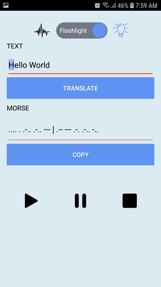

# txt2morse

## Java android app demo that convert text to morse Code

Translate text to morse code in 3 ways; text, sound and light (flashlight).

Feel free to check and/or use the source code of this project.
